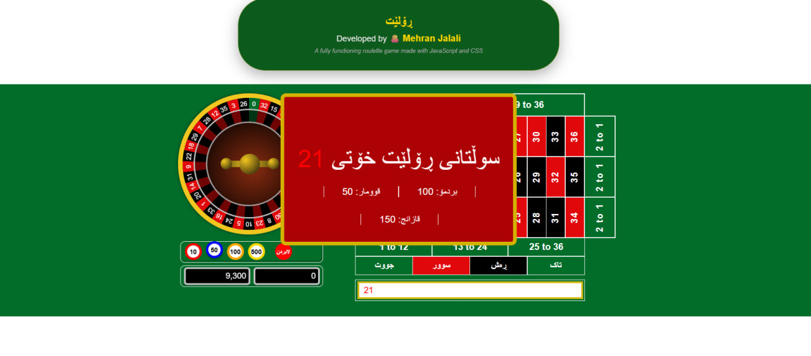

# 🎰 Javascript Roulette - Kurdish Version (وشه ی  کوردی)

**For those who want to quit gambling — roll it here instead.**

> *"When you feel like gambling, roll this wheel instead."*

---

## 🎰 Game Screenshot

---

## 🌐 Live Demo

👉 **Play the game:** [https://Mehran-Jalali.github.io/javascript-roulette/](https://Mehran-Jalali.github.io/javascript-roulette/)

---

## 🎯 Purpose

This game is for anyone trying to stop gambling. When you feel the urge, play this free roulette game. No real money, no loss, no regret.

> *"For those who want to quit — roll it, don't bet it."*

---

## ✨ Advanced Features

| Feature | Description |
|---------|-------------|
| 🪙 **Complete Betting System** | Inside bets, outside bets, columns, dozens |
| 💰 **Multiple Chip Values** | 1, 5, 10, 100, 1000 |
| 🎨 **Winning Number Highlight** | Gold flash animation on winning number |
| 📜 **Betting History** | Last 15 winning numbers with colors |
| 🖱️ **Right-Click to Remove** | Easy bet management |
| 🎰 **Realistic Wheel Animation** | Smooth spinning with physics |
| 📱 **Responsive Design** | Works on desktop and mobile |

---

## 🎮 Game Controls (Kurdish)

| Kurdish | English | Action |
|---------|---------|--------|
| **قوومار** | Bet | Place your bet |
| **بزوێنە** | Spin | Start the wheel |
| **سوور** | Red | Bet on red numbers |
| **ڕەش** | Black | Bet on black numbers |
| **جووت** | Even | Bet on even numbers |
| **تاک** | Odd | Bet on odd numbers |
| **لابردن** | Clear | Remove all bets |

---

## 💰 Payout Rates

| Bet Type | Payout |
|----------|--------|
| Single Number (Straight) | 35:1 |
| Split (2 Numbers) | 17:1 |
| Street (3 Numbers) | 11:1 |
| Corner (4 Numbers) | 8:1 |
| Column / Dozen | 2:1 |
| Red/Black / Odd/Even | 1:1 |

---

## 🛠️ Technologies Used

- ✅ **HTML5** - Structure
- ✅ **CSS3** - Styling & Animations
- ✅ **Vanilla JavaScript** - Game Logic (No Frameworks!)

---

## 📂 Project Structure
